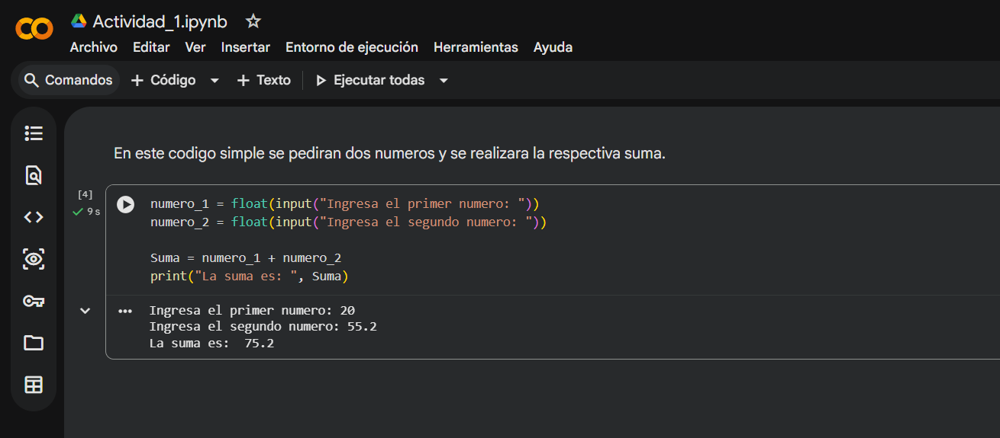
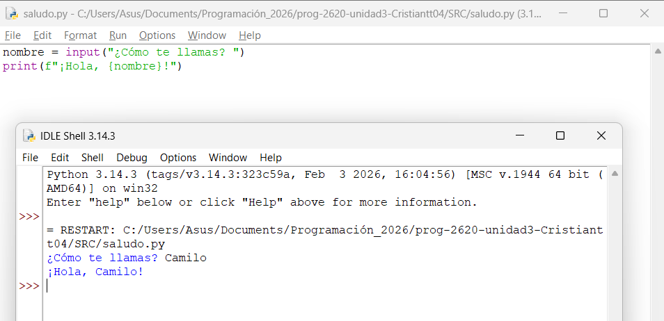
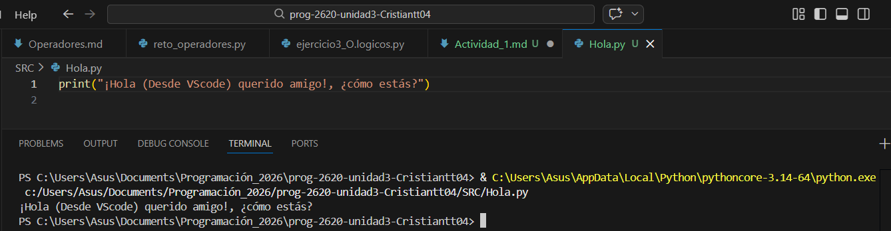

## Actividad #1 
### Ambiente de Desarrollo Integrado (IDE)

Basicamente se realiza un script basico en google colab en el cual se le pide al usuario que ingrese dos numeros y se realiza la suma de estos. 

# 

En este caso el script es realizado desde el iDEl de python, uno muy sencillo en el cual ingresas tu nombre y se muestra un saludo con el nombre que hayas ingresado. 
# 

Aqui el script se crea desde VScode

#

### 4. Responde las siguientes preguntas con tus propias palabras (Nada de definiciones con IA o copiadas de internet). 
    1. ¿Qué es un IDE?
    2. ¿Cuál es la diferencia entre los 3 IDEs estudiados en esta actividad?
    3. ¿Cuál utilizarás en el resto del curso y por qué?

#### Solución: 

1. Un IDE es por asi decirlo una caja de herramientas, ya que al momento de programar hay muchas funciones que se necesitan hacer, entre las basicas podemos encontrar la de escribir codigos, ejecutarlos y depurarlos. un IDE es un lugar que usualmente cuenta con los medios para poder hacer estas acciones basicas en un mismo entorno e incluso otorga mejoras encunto a la organización y la ayuda a la hora de se;alar errores en lineas o en palabras especificas. 

2. 
- Google cobal, trabaja en la nube, no es necesario instalar nada y puedes acceder a tus codigos y trabajos desde varios ordenandores muy facilmente. 
 
 - VScode: Muy bonito esteticamente, muy organizado y con mucha diversidad de herramientas que ayudan a más que programar. 

 - IDLE: viene integrado en python, es muy minimalista. 

 3. Por el resto del curso creo que utilizare VS code ya que me he familiarizado con este desde hace un tiempo, sus colores en general son de mi agrado y los colores a la hora de programnar hace la tarea más sencilla. 