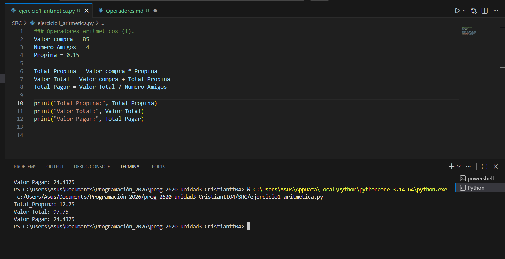
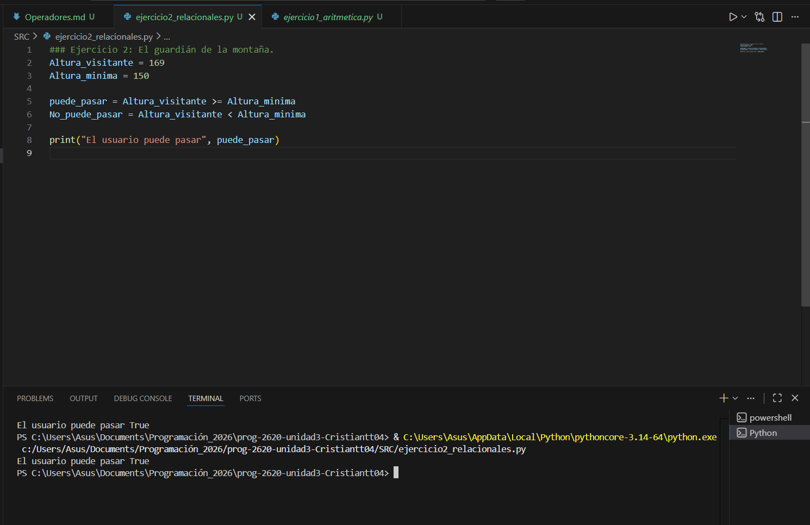
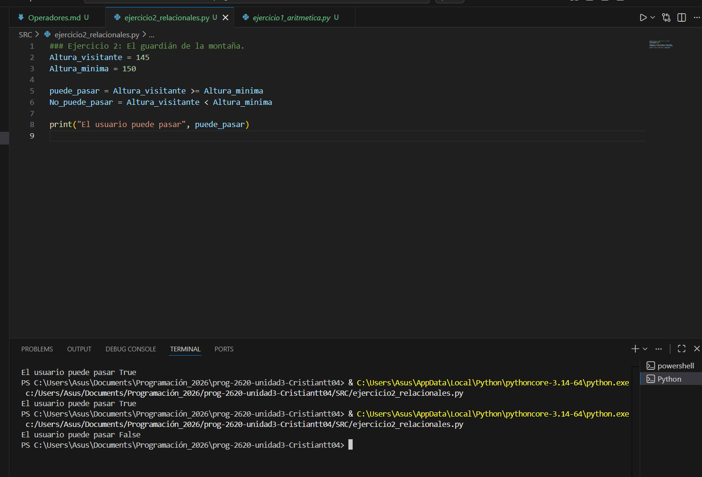
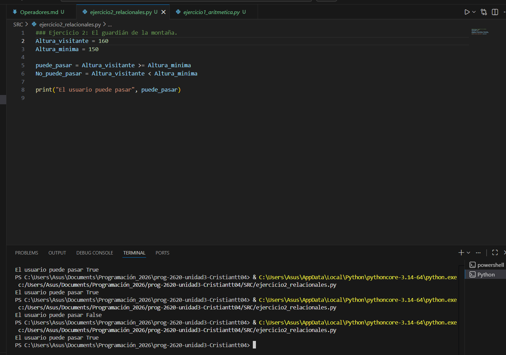
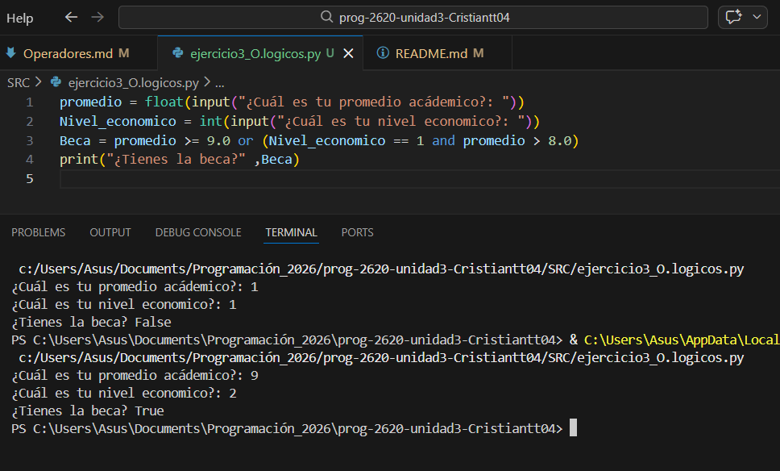
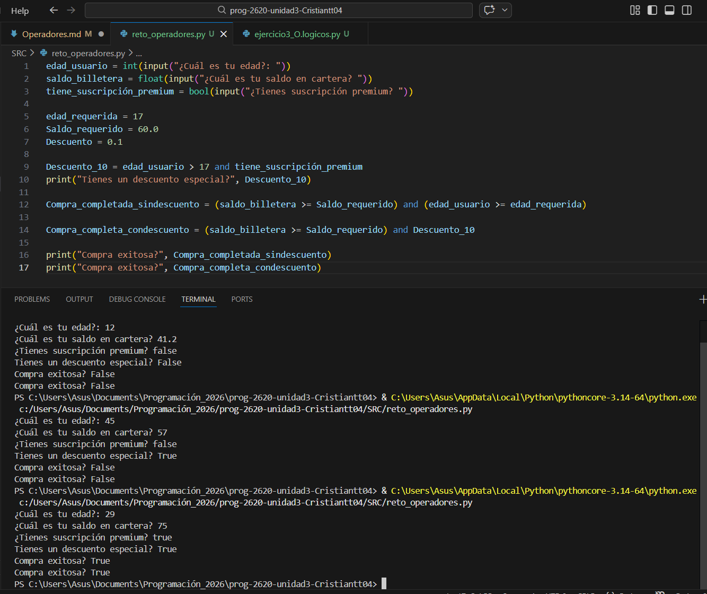

## 1. Operadores Aritméticos

### Ejercicio 1: La cuenta del restaurante. 

## 2. Operadores Relacionales. 
### Ejercicio 2: El guardián de la montaña rusa. 
Escribe tu solución, pruébala con una altura de 145 y otra de 160. Sube tus hallazgos a la bitácora de tu repositorio.

## 3. Operadores Lógicos.
 Diseña la lógica en Python utilizando variables y operadores relacionales y lógicos. Sube tu análisis y código a la bitácora de tu repositorio explicando cómo funciona la evaluación de tu programa.
### Ejercicio 3: Sistema de becas. 

 
En el programa, el usuario ingresa su promedio acádemico al igual que su nivel economico, esto usando la funcion de input y los conceptos de float and int. 

## 🚀 Reto Final de la semana. 

Sube el código de tu Reto Final a tu repositorio en un archivo llamado reto_operadores.py. En tu archivo Markdown de bitácora, explica brevemente qué se te dificultó más de este reto y cómo lo resolviste. ¡Mucho éxito!

### Solución 

En el ejercicio fue dificil relacionar las variables ya que solo podiamos utilizar operadores basicos y el "if" y el "else" al estar limitatos hizo que mi idea de mostrar el precio por el cual pagarian las personas dependiendo de si les aplicaba o no el descuento fue muy dificil y no lo pude lograr de hecho, ya que realizar un print bajo una condicion solo se puede hacer con el uso de condicionales. 