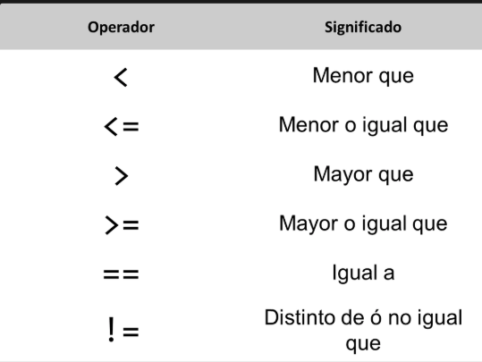
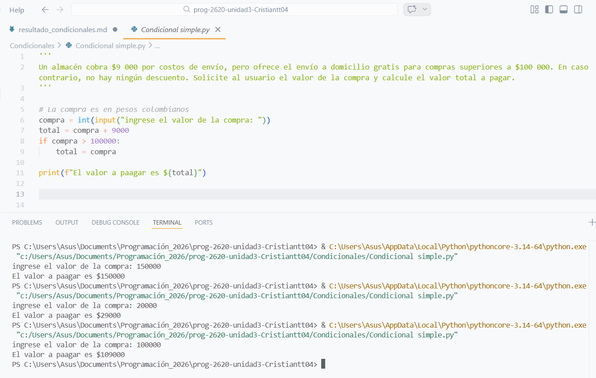
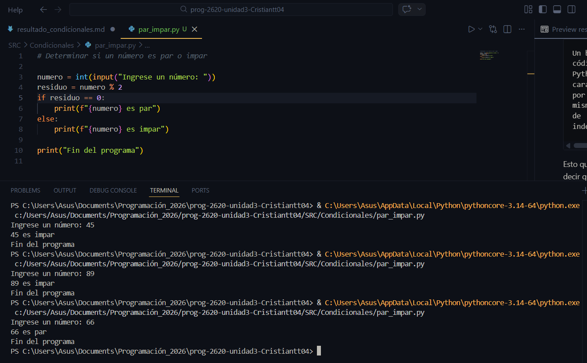
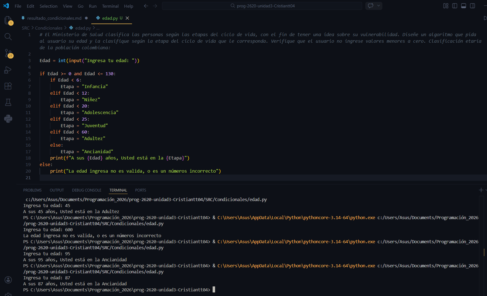
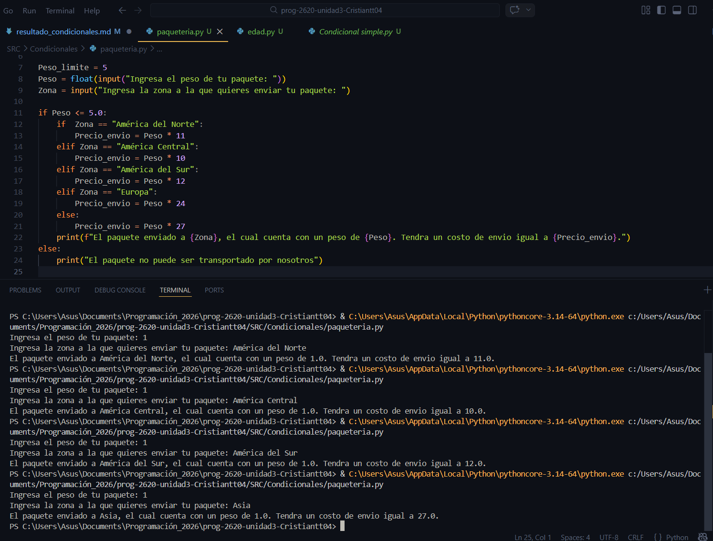

### Tipos de condiconales. 
### 1. Simple
- Solo ejecuta algo si la condición es verdadera. Si es falsa, no hace nada.

        if condicion:  
        accion 

#### Ejemplo: 
        edad = 18

        if edad >= 18:
        print("Eres mayor de edad")

- Si la condición es verdadera, imprime "Eres mayor de edad" sino, simplemente no hace nada. 

### 2. Dobles 
Aquí el programa tiene dos caminos posibles. (If / else)

- Si la condición es verdadera → hace algo 
- Si la condición no es verdadera → Hace otra cosa 

#### Ejemplo: 
        edad = 16

        if edad >= 18:
            print("Puedes entrar")
        else:
            print("No puedes entrar")

### 3. Multiple
Se usa cuando hay varias condiciones posibles, Es aqui cuando se usa el elif.     

Elif significa  "else if" → "Si no se cumple lo anterior, prueba con esta otra condición"

- Estructura: 

        if condicion1:
            accion1
        elif condicion2:
            accion2
        elif condicion3:
            accion3
        else:
            accion_final

- Solo puede haber un if. 
- Siempre se cierra la sucesion de condiciones con un else. 

### Breve recordatorio de los operadores relacionales. 

    Un bloque de código en Python se caracteriza por tener el mismo nivel de indentación.

Esto quiere decir que todas las instrucciones que pertenecen al mismo bloque deben empezar con la misma cantidad de espacios. 

        edad = 20

        if edad >= 18:
            print("Puedes entrar")
            print("Bienvenido")

Las dos líneas dentro del if tienen exactamente la misma indentación, por lo que pertenecen al mismo bloque.

Es importante esos dos puntos al final de de la condición, ya que esto indica el inicio de las sentencias. 

## Ejercicio 2 (Condicional simple)

Se realiza el codigo en la clase, se evidencian algunos ejemplos con valores como por ejemplo el de 100.000 en el cual el costo del envio se cobra de igual manera ya que la condicion para el envio gratis es de que la compra sea mayor a 100.000$. 

## Ejercicio 3 (Condicional doble)

En este caso se utiliza un operador muy interesante y util, el operador residuo "%" el cual va en medio de dos numeros, en este caso de la variable "Número" y el numero 2. lo que quiere decir esta linea de codigo es que va a dividir la variable número entre el dos en este caso y la variable "residuo" va a conservar el valor del residuo de esa division, lo cual sirve para identificar si un número es par o impar. 

## Ejercicio 4 (Condicional multiple)

En este ejercicio se uso el condiconal elif, tambien se uso una nomenclatura interesante como lo fue la "f" dentro del print, para poder mezclar texto y variables en lo que se le mostrara al usuario. 

## Ejercicio 6 

En cuanto al codigo resaltar el uso de texto como condicion, vi un problema en el codigo y es que si el ususario ingresa un lugar erroneo el codigo le asignara un precio de 27. 

